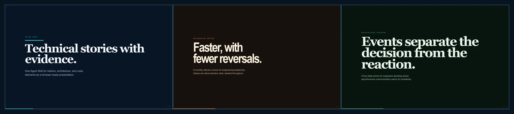

<p align="center">
  
</p>

# Slide Sage

[](https://skills.sh/rhnfzl/slide-sage)
[](https://github.com/rhnfzl/slide-sage/releases)
[](LICENSE)

**Turn technical material into a presentation people can follow.**

Slide Sage is an open-source Agent Skill for engineers, tech leads, data teams, and technical PMs. It creates data-rich HTML slide decks with charts, architecture diagrams, and code, then packages each deck as a browser-ready file.

See the [live gallery](https://rhnfzl.github.io/slide-sage/) for chart, diagram, and code examples.

## Quickstart

One command auto-detects your installed agents:

```bash
npx skills add rhnfzl/slide-sage
```

Then ask your agent:

```text
Create a metrics review for engineering leadership using these numbers:
deployment frequency 18 to 31 per week, lead time 4.2 to 2.6 days,
and change failure rate 11% to 7%.
```

<details>
<summary>Other install routes and manual use</summary>

- Claude Code plugin: `/plugin marketplace add rhnfzl/slide-sage`, then `/plugin install slide-sage@rhnfzl`
- Manual: clone this repository and link it into your agent's skills directory
- Any compatible tool: point it at `SKILL.md`

</details>

## Why this exists

1. **Technical presentations need evidence.** Slide Sage treats metrics, charts, diagrams, and code as first-class content instead of decoration.
2. **Generated slides need guardrails.** Every slide is constrained to the viewport, uses responsive type, supports keyboard navigation, and includes reduced-motion and print behavior.
3. **The output should stay portable.** A deck opens directly in a browser. Chart-free decks can be fully local, while richer decks use pinned CDN libraries by default or opt into inline-vendored assets for offline delivery.

## What it makes

| Mode | Use it for |
|---|---|
| New presentation | Metrics reviews, architecture walkthroughs, teaching decks, technical pitches |
| PowerPoint or PDF conversion | Turning existing material into an interactive HTML deck |
| HTML enhancement | Improving an existing deck without discarding its content or visual language |

## What's in the box

| Piece | What it does |
|---|---|
| `SKILL.md` | Chooses the workflow, content shape, visual style, and delivery checks |
| `assets/viewport-base.css` | Enforces one-screen slides, responsive type, navigation, print, and accessibility basics |
| `references/` | Focused guidance for charts, diagrams, code, animation, themes, and presenter mode |
| `templates/` | Reusable comparison layouts, SVG diagrams, and icons |
| `scripts/` | PowerPoint/PDF extraction, image processing, validation, and export helpers |
| `examples/` | Finished decks showing metrics, architecture, and code treatment |
| `evals/` | Executable behavior checks for new, conversion, and enhancement workflows |

## A deck stays a file

Slide Sage does not require a presentation runtime, account, or hosted editor. The generated HTML contains its CSS and presentation logic. Optional libraries are included only when the content needs them.

Use Slide Sage when the final delivery can be HTML or PDF and the material benefits from interactive charts or technical visuals. If native, editable PowerPoint output is the requirement, use Anthropic's `pptx` skill instead.

## How it works

1. The agent identifies whether the task is a new deck, a conversion, or an enhancement.
2. It reads only the references needed for the material, then chooses a tone-led visual preset.
3. It generates one HTML file and checks the viewport, CSS classes, data labeling, and delivery path.

## Built-in quality bar

- Every slide fits `100vh` with no internal scrolling
- All text scales with `clamp()` and short-height breakpoints
- Charts use colorblind-safe palettes and visible data labels or accessible fallbacks
- Diagrams prefer CSS/HTML, then reusable SVG templates, then custom inline SVG
- Code uses language-aware highlighting and stays within a readable line budget
- Arrow keys, space, page keys, Home, End, and touch gestures navigate the deck
- `prefers-reduced-motion` and print styles are included
- Static validation runs even when a browser is unavailable

## Examples

| Deck | Shows |
|---|---|
| [Slide Sage introduction](examples/slide-sage-intro.html) | Product story, chart, diagram, and code in one deck |
| [Engineering metrics review](examples/metrics-review.html) | KPI hierarchy and a sourced trend chart |
| [Event-driven architecture](examples/architecture-teaching.html) | A technical teaching flow with CSS diagrams and code |

Open any example in a browser. Use arrow keys to navigate, `?` for shortcuts, and Print > Save as PDF for a printable copy.

## Requirements

A modern browser is enough for generated decks. Python 3.11+ plus the packages in `scripts/requirements.txt` is needed only for PowerPoint/PDF conversion and image processing. Automated PDF export uses Playwright when available; browser print remains the zero-dependency fallback.

## Trust

- Installing copies files. It does not run code or add a postinstall hook.
- Slide Sage adds no telemetry or analytics.
- CDN imports are browser-only, version-pinned, and included only when a deck uses them.
- Python scripts run only on explicit invocation.
- Speaker notes and embedded data remain readable inside a shared HTML file.

Read [SECURITY.md](SECURITY.md) for the complete external-touchpoint rationale.

## Agent support

Slide Sage follows the [Agent Skills](https://agentskills.io) format. `npx skills add` installs it for supported agents including Claude Code, Codex, Cursor, GitHub Copilot, Gemini CLI, OpenCode, Amp, and others.

## License

[MIT](LICENSE)
